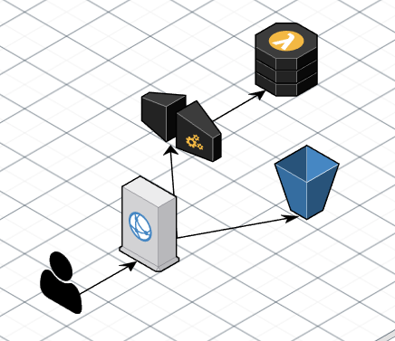

# Backend, Frontend AWS CDK

A basic app deployed with AWS CDK with both a backend and frontend component.

This is basically me attempting to replace [Netlify](https://www.netlify.com/) and [Netlify Functions](https://www.netlify.com/products/functions/) so that I can integrate with other AWS services. See [Internal Magic Links AWS CDK](https://github.com/cadbox1/internal-magic-links-aws-cdk) for more.

I highly recommend Netlify and Netlify Functions if you just need a frontend and some backend functions and it's worked extremely well for [Very Nested](https://github.com/cadbox1/very-nested).

## AWS Services



1. All requests go the the Cloudfront distribution
1. The cloudfront distribution sends `/api/*` requests to an API Gateway, backed by Lambda.
1. All other static requests are served by an S3 bucket

## Development

 * `yarn build`         build the frontend so it's ready to deploy
 * `yarn test`          perform the jest unit tests
 * `yarn deploy`        build the frontend and deploy the cdk stack
 * `yarn cdk bootstrap` prepare the AWS region for cdk deployments
 * `yarn cdk destroy`   destroy the deployment

## Getting Started
1. Create an [AWS account](https://aws.amazon.com/).
1. Enable MFA on your Root account.
1. Create an IAM user with programmtic access and assign the FullAdministratorAccess permission.
1. Download the credentials.
1. Setup your credentials with `vi ~/.aws/credentials`.
    ```
    [account-name]
    aws_access_key_id=
    aws_secret_access_key=
    ```
1. Run `yarn` to install dependencies.
1. Set the region in `bin/lambda-cdk.ts`.
1. Run `yarn cdk bootstrap --profile account-name`.
1. Run `yarn deploy`.

### Frontend Local Dev
1. Copy the cloudfront distribution url.
1. Paste it into the proxy field in the `src/frontend/package.json`.
1. `cd src/frontend`.
1. `yarn start`.

## References

- [Getting Started](https://docs.aws.amazon.com/cdk/latest/guide/getting_started.html)
- [Serverless Guide](https://docs.aws.amazon.com/cdk/latest/guide/serverless_example.html)
- [Backend example](https://github.com/aws-samples/aws-cdk-examples/tree/master/typescript/api-cors-lambda-crud-dynamodb)
- [Static site example](https://github.com/aws-samples/aws-cdk-examples/tree/master/typescript/static-site)
- [Setup Cloudfront with API Gateway](https://stackoverflow.com/a/57467656/728602)
- [Match paths in API Gateway and Cloudfront](https://stackoverflow.com/questions/32825413/how-do-you-add-cloudfront-in-front-of-api-gateway/53804396#53804396)
- [Forward headers from Cloudfront to API Gateway](https://stackoverflow.com/questions/47366993/missing-authentication-token-error-with-cloudfront-api-gateway/47380572#47380572)


## Challenges
The [aws-lambda] module does *NOT* package node_modules whereas [aws-lambda-nodejs](https://docs.aws.amazon.com/cdk/api/latest/docs/aws-lambda-nodejs-readme.html) does. It's a [bit slow](https://github.com/aws/aws-cdk/issues/9120) but there's some discussions about potential fixes for that in the pipeline.

Your Cloudfront path pattern must much your API Gateway path. See [this SO](https://stackoverflow.com/questions/32825413/how-do-you-add-cloudfront-in-front-of-api-gateway/53804396#53804396) for more.

## Future Development
1. Setup CI/CD with GitHub Actions
1. Use the HTTP API in API Gateway
1. Move the backend and cdk into their own packages. Would be good to share code between the frontend and backend.
1. Custom domain setup with cloudfront
1. Setup an AWS Budget

## Other Options
### Serverless framework
I started with [Serverless framework](https://serverless.com/) but found the [fullstack example](https://github.com/serverless/examples/tree/master/aws-node-fullstack) to be a bit strange, particularly the part where you [manually enter the backend url](https://serverless.com/) for the frontend to use.

That means it's not a single command deploy and also suggests it's using CORS instead of routing api requests with Cloudfront which I wasn't thrilled about.

These were the only discussions I found on the topic and they weren't that helpful.
- https://forum.serverless.com/t/same-domain-name-for-front-end-and-for-lambda-function-endpoints/4113
- https://forum.serverless.com/t/front-end-and-backend-with-serverless/5872/2


### AWS Sam

[Doesn't support static websites yet.](https://github.com/awslabs/serverless-application-model/issues/624)


## Time Spent

11h.

I haven't done much infrastructure as code or serverless before and that was spent across this repo, [Internal Magic Links AWS CDK](https://github.com/cadbox1/internal-magic-links-aws-cdk), trying out serverless framework and a bunch of investigation.

## DIY

- mkdir lambda-cdk
- cd lambda-cdk
- nvm use 12.18.3
- npm install -g aws-cdk
- cdk init --language typescript
- echo "12.18.3" > .nvmrc
- yarn
- yarn add --dev aws-cdk
- code ./ -n
- yarn add --dev prettier
- yarn add aws-sdk
- yarn add --dev @aws-cdk/aws-apigateway @aws-cdk/aws-lambda-nodejs @types/aws-lambda
- update the cdk code
- create a src folder and create a function
- update the region in `bin/lambda-cdk.ts`
- yarn cdk bootstrap --profile account-name
- yarn add --dev @aws-cdk/aws-cloudfront @aws-cdk/aws-s3 @aws-cdk/aws-s3-deployment
- update cdk
- cd src
- npx create-react-app frontend
- add .env for skip pre flight check
- remove *.js from cdk gitignore and add `noEmit: true` to root tsconfig
- remove unused files from cra
- add typescript to cra
- yarn add axios @cadbox/use-promise
- update the proxy url
- write the frontend code


